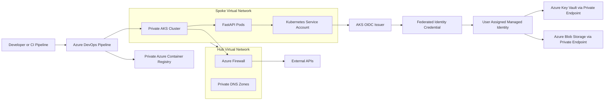
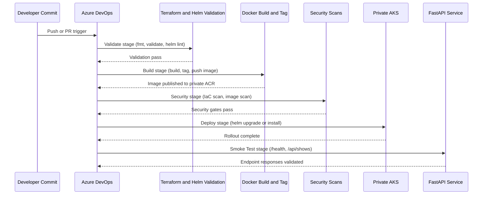

# Platform Engineering Assessment

## Solution Overview

This repository contains a production-oriented reference implementation for deploying and operating a FastAPI workload on Azure Kubernetes Service (AKS) using secure-by-default patterns.

The solution includes:
- Infrastructure as Code with Terraform modules
- A containerized FastAPI application with health and functional endpoints
- Helm-based packaging and deployment
- Azure Workload Identity integration for secretless access to Azure resources
- Private networking patterns for AKS and data plane dependencies
- CI/CD pipeline definition for validate, build, security, deploy, and smoke-test stages

The target posture is enterprise-ready operation with strong controls over identity, egress, DNS, and runtime security.

## Architecture Diagram



## Infrastructure Components

Core infrastructure and platform components include:

- Azure Kubernetes Service configured as a private cluster
- Hub-and-spoke virtual networking model
- Azure Firewall for centralized outbound control
- Private Endpoints for ACR, Key Vault, and Storage access patterns
- Private DNS Zones and VNet links for deterministic name resolution
- User Assigned Managed Identity and Federated Identity Credential for workload authentication
- Terraform module structure for environment lifecycle management
- Helm chart for Kubernetes application packaging and release management

## Security Controls

Implemented and documented controls include:

- Private AKS API surface to reduce control-plane exposure
- Private data plane access through Private Endpoints
- Centralized egress inspection and allow-listing through Azure Firewall
- Workload Identity instead of static secrets or connection strings
- Azure RBAC-based authorization with scoped permissions
- Container hardening controls:
	- Non-root runtime user
	- Read-only root filesystem
	- Linux capability drop
- Health probes for operational resilience
- CI/CD security gates:
	- Terraform security scan
	- Container vulnerability scan

## Networking Design

The networking approach follows a segmented enterprise topology:

- Hub and spoke virtual network model
- Spokes host workload resources; hub centralizes security and shared controls
- User Defined Routes direct egress through Azure Firewall
- Private AKS cluster with private control-plane access
- Private Endpoints for platform dependencies to keep traffic on private paths
- Azure CNI Overlay to improve pod IP scalability while preserving manageable VNet address usage
- Private DNS Zones ensure private resolution for control and data plane dependencies

## Identity Design

Identity and access are built around federated workload authentication:

- AKS OIDC issuer provides signed pod identity tokens
- Kubernetes Service Account is mapped to a User Assigned Managed Identity through Federated Identity Credential
- Pod obtains short-lived Azure access tokens through token exchange
- Azure RBAC grants least-privilege access to target resources (for example Storage and Key Vault)
- No long-lived application secrets are required in Kubernetes

Authentication flow:

API Pod -> Kubernetes Service Account -> OIDC Token -> Federated Credential -> Managed Identity -> Azure Resource

## Deployment Flow



## Repository Structure

```text
assessment/
	README.md
	aks/
	app/
	docs/
		AKS_WORKLOAD_IDENTITY_ARCHITECTURE.md
		BLOB_STORAGE_CACHING.md
		HELM_CHART_ASSESSMENT.md
		HELM_CHART_VERIFICATION.md
		aks-platform.md
		architecture.md
		decisions.md
		issues-and-lessons-learned.md
		networking.md
		private-networking.md
		private-services.md
		workload-identity.md
	helm/
		shows-api/
	pipelines/
		azure-pipelines.yml
		vars.yml
	terraform/
```

## Assumptions

- A self-hosted Azure DevOps agent exists with private network connectivity to AKS and private endpoints
- Azure CLI, kubectl, terraform, helm, docker, and scanning tools are available on the agent
- Private AKS cluster and private ACR are already provisioned or managed by Terraform in this repository
- Appropriate Azure service connection is configured in Azure DevOps
- Required RBAC role assignments for Managed Identity are provisioned
- DNS forwarding and private zone links are configured for all required private endpoint FQDNs

## Limitations

- Smoke tests currently validate baseline functional availability, not full end-to-end business scenarios
- Security scanning quality depends on scanner rule sets and update cadence on the build agent
- Multi-environment promotion controls are not fully modeled as separate release strategies in this repository
- Disaster recovery and cross-region failover patterns are not implemented in this baseline
- Policy-as-code enforcement (for example OPA or Azure Policy gate checks in pipeline) is out of current scope

## Validation Performed

Validation activities completed for this assessment include:

- Terraform validation workflow execution and iterative module compatibility fixes
- Terraform planning issue remediation for private DNS `for_each` by using deterministic map keys (hub/spoke) with apply-time IDs as values
- Helm chart lint validation with zero lint failures
- Helm template rendering checks using default and custom values
- Verification of configurable image repository, image tag, and namespace behavior
- Verification of readiness and liveness probes against health endpoint
- Verification of resource requests and limits presence in manifests
- Verification of Workload Identity annotations and labels in rendered templates
- Python application syntax validation
- Documentation review for architecture and decision traceability

## Assessment Outcome

The repository demonstrates a practical, security-focused AKS deployment baseline suitable for assessment submission. It provides a coherent architecture across infrastructure, workload runtime, identity, networking, and deployment automation, with explicit design decisions and validation evidence.
